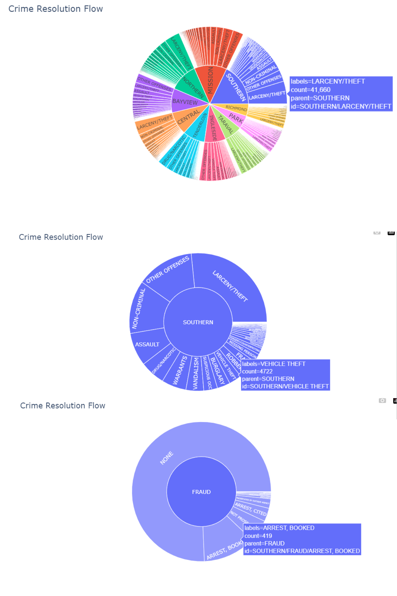

# 🕵️‍♀️ Crime Data Analysis Project

## 📌 Overview
This project analyzes crime data from **San Francisco** using advanced **machine learning** and **data visualization** techniques. It includes:

- Hierarchical Clustering (optimized via Genetic Algorithm)  
- Random Forest Classification  
- K-Medoids Clustering  
- Rich visual insights into crime trends

---

## 📊 Dataset

| Dataset | Records | Features |
|---------|---------|----------|
| Training | 878,049 | 9 |
| Test     | 884,262 | 7 |

**Key Features**:
- Temporal: `Dates`, `DayOfWeek`
- Location: `Address`, `X`, `Y`, `Police District`
- Descriptive: `Category`, `Description`, `Resolution`

---

## 🧹 Data Preprocessing

### 🔧 Data Cleaning
- Removed **2,323 duplicate** records
- Excluded **67 records** with invalid coordinates (outside SF)

### 🛠️ Feature Engineering
- Extracted: `Year`, `Month`, `Day`, `Hour`
- Encoded: `Category`, `Police District`
- Normalized coordinate values for ML compatibility

---

## 🧪 Analysis Techniques

### 1️⃣ Hierarchical Clustering (with Genetic Algorithm)

- **Goal**: Identify optimal clusters for crime locations  
- **Approach**:
  - Tuned hyperparameters using a genetic algorithm
  - Evaluated clustering via **silhouette score**

✅ **Best Parameters**:
- Clusters: `3`
- Linkage: `Average`
- Distance: `Euclidean`  
📈 Silhouette Score: `0.497`

#### 📊 Hierarchical Visualization


---

### 2️⃣ Random Forest Classification

#### 🔹 Model 1: Police District Prediction
- Features: `X`, `Y` (coordinates)
- Accuracy: 
  - Train = `99.32%`
  - Test = `99.28%`

#### 🔹 Model 2: Crime Category Prediction
- Features: `X`, `Y`, `Police District`, `Description`
- Accuracy:
  - Train = `99.71%`
  - Test = `98.78%`

---

### 3️⃣ K-Medoids Clustering

- Optimal number of clusters: **3**  
- Silhouette Score: `0.491`

#### 🗺️ Cluster Breakdown:
| Cluster | Region            | #Crimes |
|---------|-------------------|---------|
| 0       | Southwest          | 1,627   |
| 1       | Central/Northeast  | 5,967   |
| 2       | Southeast          | 2,406   |

**Top Crime**: `LARCENY/THEFT` was the most common in all clusters  
🕒 Notable temporal trends were observed in each cluster

#### 📊 Cluster Visualization

---

## 📊 Visualizations

1. **Interactive Crime Map**: Animated geographical distribution  
2. **Crime Clock**: 24-hour crime activity cycle  
3. **Day-of-Week Chart**: Frequency of crimes by weekday  
4. **Sunburst Chart**: Hierarchical view of crime resolution paths  
5. **Cluster Plots**: Geographic/categorical crime distribution

---

## 🔍 Key Findings

### 🗺️ Spatial Patterns
- Distinct regional clusters of crime types
- Some regions show high density of specific crime categories

### 🕒 Temporal Trends
- **Fridays** have the highest crime rates  
- Daily peaks occur during **late evening hours**

### 🔎 Category Insights
- `LARCENY/THEFT` is the most common category  
- `OTHER OFFENSES` and `NON-CRIMINAL` are also frequent

---

## 📷 Preview
### 🗺️ Interactive Crime Map


### 🕒 Crime Clock


### 📊 Cluster Visualization


### 🌪️ Crime Resolution Flow


--

## 📦 Dependencies

Make sure to install the following packages:

```txt
pandas  
numpy  
scikit-learn  
scipy  
matplotlib  
seaborn  
plotly  
scikit-learn-extra
